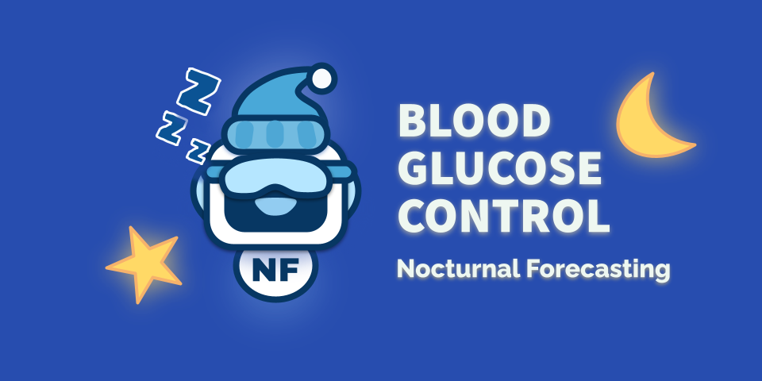

# Probabilistic Forecasting of Nocturnal Hypoglycemia

Fear of nocturnal hypoglycemic events continues to be one of the most significant contributors to diabetes distress.
Developing improved nocturnal hypoglycemic forecasting techniques would likely improve diabetes distress [(D. Ehrmann et al., 2024)](https://doi.org/10.1177/19322968241267886), but even short 2-hour blood glucose level (BGL) forecasting remains challenging [(H. Nemat et al., 2024)](https://www.nature.com/articles/s41598-024-70277-x).
Forecasting BGL over an 8-hour time window does not seem feasible with SOTA techniques, likely due to the limited scale of most BGL time series datasets.
The most popular open-source T1D dataset, OhioT1DM, only contains 12 patients over eight weeks [(C. Marling,2020)](https://www.ncbi.nlm.nih.gov/pmc/articles/PMC7881904/).
Our student volunteer-based WAT.ai Blood Glucose Control Design Team, in partnership with Gluroo, aims to reframe the forecasting problem into a big data *probabilistic* forecasting problem.

Probabilistic forecasting is about producing low and high scenarios, quantifying their uncertainty, and delivering expected ranges of variation [(T. Gneiting et al., 2014](https://www.annualreviews.org/content/journals/10.1146/annurev-statistics-062713-085831), [F. Kiraly et al., 2022)](https://www.sktime.net/en/stable/examples/01b_forecasting_proba.html).
Our view is that this framing is more technically feasible yet will be just as valuable in alleviating diabetes distress related to fears of nocturnal hypoglycemic events.

## Methods
Our research will consider months of data from thousands of *de-identified* Gluroo patients. With skTime [(F. Kiraly, 2024)](https://zenodo.org/records/14337818) we will evaluate various interval, quantile, variational, and distributional forecasting techniques to maximize the sharpness of our predictive distributions [(T. Gneiting et al., 2014,](https://www.annualreviews.org/content/journals/10.1146/annurev-statistics-062713-085831), [F. Kiraly et al., 2022)](https://www.sktime.net/en/stable/examples/01b_forecasting_proba.html).
We will contrast our forecasts over various categories, including age groups, gender, years with diabetes, and weekend vs. weekday forecasting.

## Project Setup

For instructions on getting started with our project and the commmit/PR procedure please see our wiki article: [Getting Started Developing with this Repo](https://github.com/Blood-Glucose-Control/nocturnal-hypo-gly-prob-forecast/wiki/Get-Started-Developing-with-this-Repo)

### Data Downloads
#### Kaggle

See script: [BrisT1D](scripts/data_downloads/README_data_download.md)
