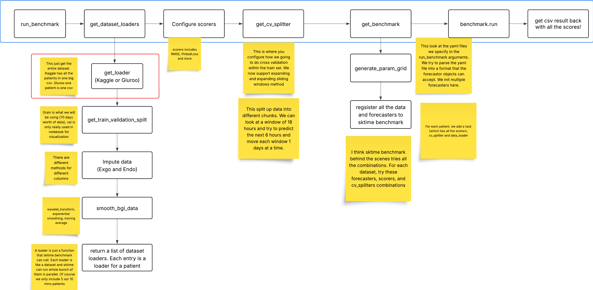

!!! warning "Under Construction"
    This documentation is currently under active development and subject to change.
    Some sections may be incomplete or missing.
## Model Benchmarking <a id="model-benchmarking"></a>

- need to include Tony's documentation here.


### Hyperparameter YAML Configuration Guide

This README explains how to define hyperparameter options for each forecasting model in YAML format to be used for tuning.

#### General Structure of a YAML Entry

Each model should be added as a top-level key in the YAML file, with parameters specified as nested keys:

```yaml
ModelName:
  parameter_name:
    type: <one of supported parameter types>
    # other parameters will depend on `type`, see below
```

> **IMPORTANT**: The `type` parameter does NOT correspond to the data type, it corresponds to the specific parameter types described [below](#supported-parameter-types--best-practices). Please read through each of these carefully.

#### Supported Parameter Types & Best Practices <a id="supported-parameter-types--best-practices"></a>

##### List (Categorical Parameters)
- Generates your `values` list as is in the parameter grid.
- Use when the parameter takes a predefined set of values.
- Best for options like trend types, seasonal components, or model selection.

Example:
```yaml
AutoARIMA:
  seasonal_order:
    type: list
    values: [[0, 1, 1, 7], [1, 1, 1, 12]]
```

##### Integer (Discrete Ranges)
- Generates a range of integers specified by the start, end, and step values you provide in the `range` value.
- Use when the parameter is a whole number within a logical range.
- Best for order selection (e.g., AR, MA terms in ARIMA), tree depths, or iteration counts.

Example:
```yaml
AutoARIMA:
  max_order:
    type: int
    range: [1, 5]
```

##### Float (Continuous Ranges)
- Generates a range of decimals specified by the start, end, and step values you provide in the `range` value.
- Use when the parameter can take decimal values within a range.
- Best for learning rates, smoothing factors, or penalty terms.

Example:
```yaml
ExpSmoothing:
  smoothing_level:
    type: float
    range: [0.1, 1.0, 0.1]  # Start, End, Step
```

##### Boolean (True/False Options)
- Generates `[True, False]` in the param grid. Does not require any additional keys like `values` or `range`.
- Use for settings that toggle features on or off.
- Best for enabling/disabling trend components, intercepts, or constraints.

> If you want to set a fixed bool value (e.g. setting the `suppress_warnings` parameter to always `True`), do not use this type, as it will generate `[True, False]` in the parameter grid regardless of the `values` parameter you set. Instead use `type: list` and `values: [True]` (or whichever bool you want to use).

Example:
```yaml
AutoARIMA:
  with_intercept:
    type: bool
```

##### Estimators
- Generates an instance of an estimator. The `estimators` key should contain a list of the estimator types you want to use, and the `estimator_kwargs` key should contain a list of dictionaries, where each dictionary holds the arguments to pass into the corresponding estimator.
  - Specify whether it's a regressor (`sklearn`) or a forecaster (`sktime`) in the `type` value
  - The position of each dictionary in `estimator_kwargs` should match the position of the estimator it is meant for in the `estimators` list. For no arguments, pass an empty dictionary.
  - The `estimators` entries should be the name of the estimators as listed in the sktime estimator registry.
- Use for estimators that take other estimators as parameters (e.g. [DirectTabularRegressionForecaster](https://www.sktime.net/en/latest/api_reference/auto_generated/sktime.forecasting.compose.DirectTabularRegressionForecaster.html)).

Forecaster Example:
```yaml
DirectTabularRegressionForecaster:
  estimator:
    type: forecaster
    estimators: ["ARIMA"]
    estimator_kwargs: [
        {
            order: [1, 0, 0],
            suppress_warnings: True,
        }
    ]
```

Regressor Example:
```yaml
VARReduce:
  regressor:
    type: regressor
    estimators: ["LinearRegression"]
    estimator_kwargs: [{}]
```
