# Visualization Guide and Example Gallery

This page documents the maintained visualization scripts in [scripts/visualization/](/data/home/cjrisi/nocturnal-hypo-gly-prob-forecast/scripts/visualization), their duplication assessment status, and a clean example artifact for each script.

## Example storage location

For MkDocs-facing visualization examples, the canonical committed location is:

- [docs/assets/visualizations/examples/](/data/home/cjrisi/nocturnal-hypo-gly-prob-forecast/docs/assets/visualizations/examples)

For scripts that naturally produce multiple files (appendix panels or per-episode outputs), examples live in script-specific subfolders under that directory.

## Duplication assessment (Wave 4)

| Family | Scripts | Duplication level | Decision |
|---|---|---:|---|
| Episode overlays | `plot_forecast_episode_overlays.py`, `plot_forecast_comparison.py` | Low | Keep separate (single-model uncertainty overlays vs multi-model head-to-head episode comparison). |
| RMSE vs horizon | `plot_rmse_vs_horizon.py`, `plot_rmse_vs_horizon_grid.py` | Medium | Keep both (distributional boxplots vs cross-model comparative grid); shared loading/stats already centralized in [src/visualization/nocturnal.py](/data/home/cjrisi/nocturnal-hypo-gly-prob-forecast/src/visualization/nocturnal.py). |
| Step sweeps | `plot_step_sweep.py`, `plot_step_sweep_long_run.py`, `plot_checkpoint_metric_vs_steps.py` | Medium | Keep all three (different step regimes and aggregation contracts); retain generic series mapping surfaces. |
| PIT / calibration | `plot_pit_histograms.py`, `plot_pit_horizon_heatmap.py`, `plot_pit_combined.py`, `plot_reliability_diagrams.py` | Medium | Keep all four (complementary calibration diagnostics at global, per-horizon, and quantile-reliability levels). |
| Coverage/sharpness | `plot_coverage_error_2d.py`, `plot_coverage_error_2d_sharpness.py`, `plot_coverage_sharpness_scatter.py` | Medium | Keep all three (different 2D/3D encodings and readability trade-offs for calibration-vs-sharpness). |
| Percentile grid | `plot_probabilistic_forecast_grid.py` | Low | Keep (dataset-by-percentile interpretability surface not duplicated elsewhere). |

## Per-script examples and interpretation

### `plot_forecast_comparison.py`

**Stored example:** [plot_forecast_comparison.png](/data/home/cjrisi/nocturnal-hypo-gly-prob-forecast/docs/assets/visualizations/examples/plot_forecast_comparison.png)

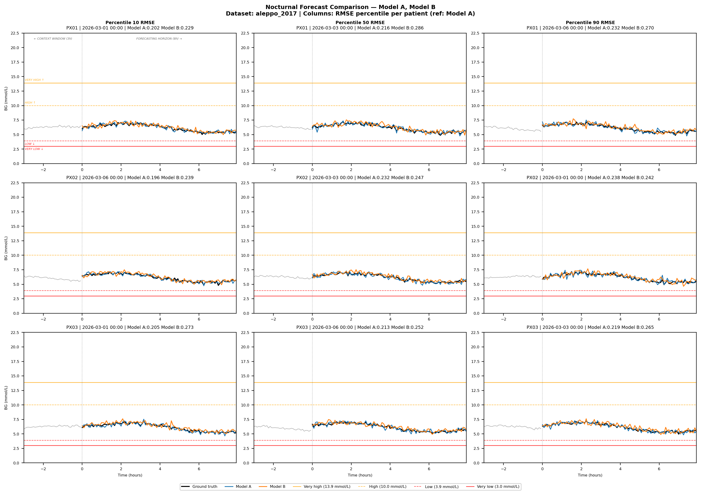

Use this to compare competing models on identical episodes. Look for consistent wins on hard-percentile columns and threshold-tracking behavior near hypo regions.

### `plot_checkpoint_metric_vs_steps.py`

**Stored example:** [plot_checkpoint_metric_vs_steps.png](/data/home/cjrisi/nocturnal-hypo-gly-prob-forecast/docs/assets/visualizations/examples/plot_checkpoint_metric_vs_steps.png)

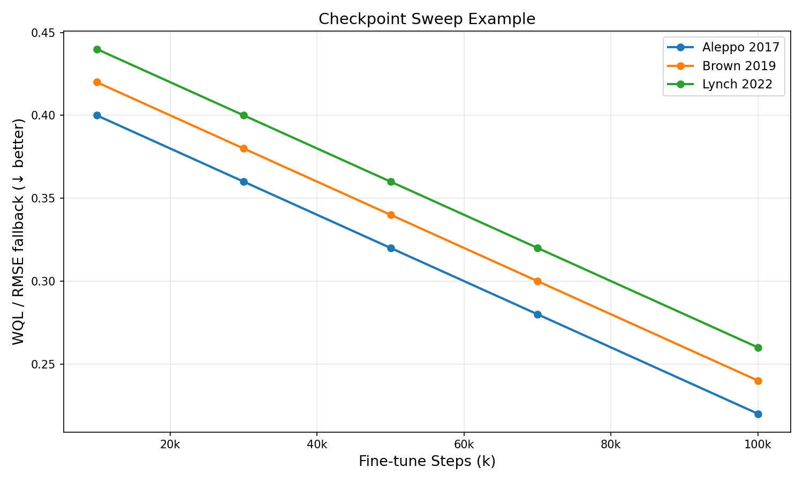

Use this to find checkpoint sweet spots per dataset. Look for metric plateaus or reversals that indicate overtraining.

### `plot_coverage_error_2d.py`

**Stored example:** [plot_coverage_error_2d.png](/data/home/cjrisi/nocturnal-hypo-gly-prob-forecast/docs/assets/visualizations/examples/plot_coverage_error_2d.png)

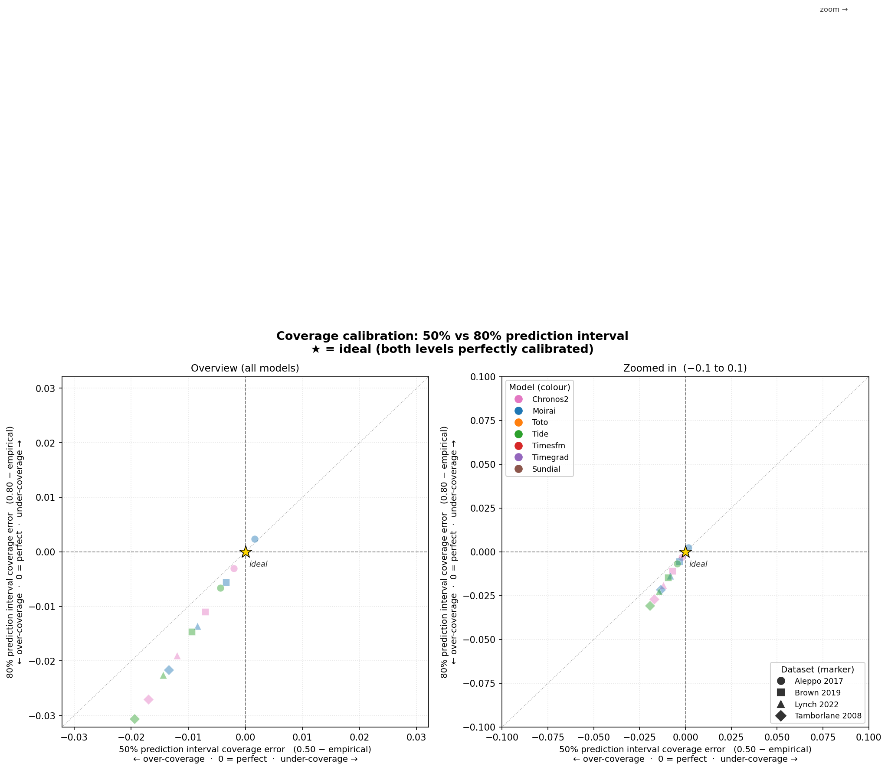

Use this to assess 50% and 80% interval calibration jointly. Best models cluster near the origin (0,0).

### `plot_coverage_error_2d_sharpness.py`

**Stored example:** [plot_coverage_error_2d_sharpness.png](/data/home/cjrisi/nocturnal-hypo-gly-prob-forecast/docs/assets/visualizations/examples/plot_coverage_error_2d_sharpness.png)

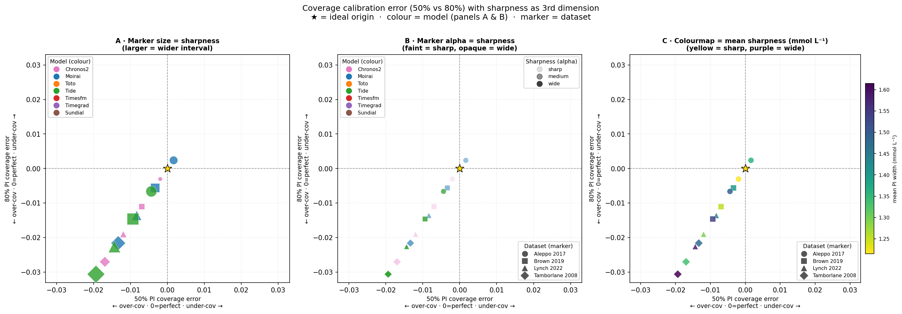

Use this when you need calibration error and sharpness in the same visual. Look for points near origin with smaller/lower-sharpness encodings.

### `plot_coverage_sharpness_scatter.py`

**Stored example:** [plot_coverage_sharpness_scatter.png](/data/home/cjrisi/nocturnal-hypo-gly-prob-forecast/docs/assets/visualizations/examples/plot_coverage_sharpness_scatter.png)

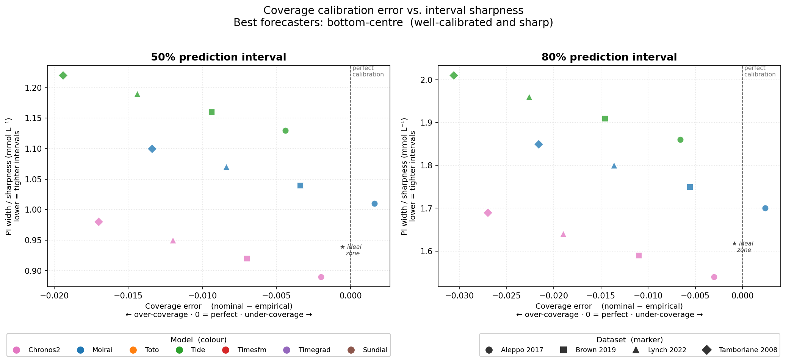

Use this to inspect calibration-vs-sharpness tradeoffs by PI level. Bottom-center clusters indicate good calibration with tighter intervals.

### `plot_forecast_episode_overlays.py`

**Stored examples:**
- [combined.png](/data/home/cjrisi/nocturnal-hypo-gly-prob-forecast/docs/assets/visualizations/examples/plot_forecast_episode_overlays/combined.png)
- [plot_forecast_episode_overlays/](/data/home/cjrisi/nocturnal-hypo-gly-prob-forecast/docs/assets/visualizations/examples/plot_forecast_episode_overlays)

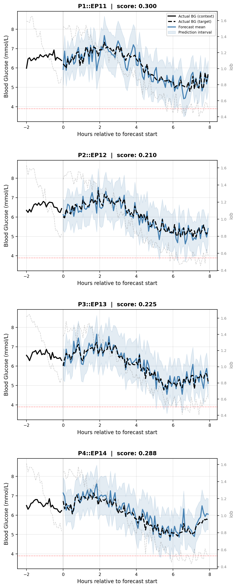

Use this for episode-level qualitative inspection of mean and interval behavior. Look for interval escapes and forecast lag around rapid BG transitions.

### `plot_step_sweep_long_run.py`

**Stored example:** [plot_step_sweep_long_run.png](/data/home/cjrisi/nocturnal-hypo-gly-prob-forecast/docs/assets/visualizations/examples/plot_step_sweep_long_run.png)

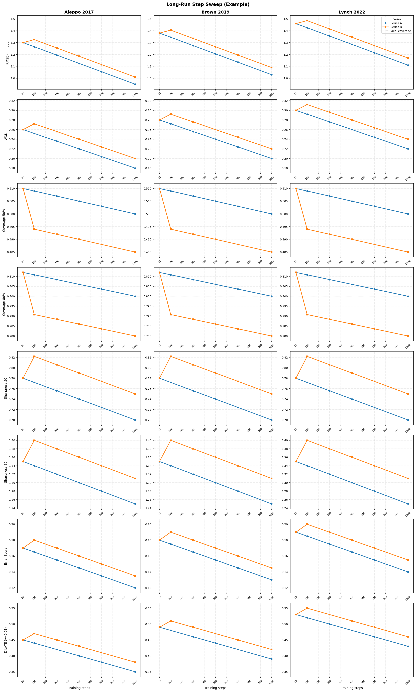

Use this to compare long-horizon training dynamics across series. Look for late-step regressions and calibration drift despite RMSE improvements.

### `plot_pit_combined.py`

**Stored example:** [pit_combined.png](/data/home/cjrisi/nocturnal-hypo-gly-prob-forecast/docs/assets/visualizations/examples/plot_pit_combined/pit_combined.png)

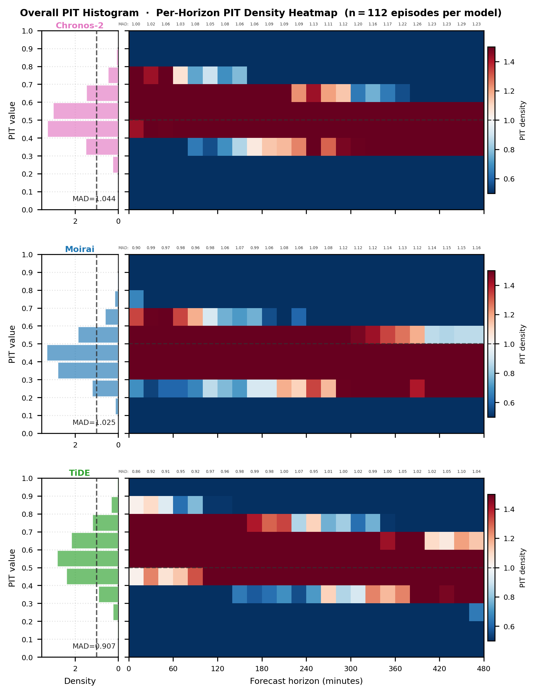

Use this as the compact calibration dashboard: histogram for global shape errors and heatmap for horizon-localized drift.

### `plot_pit_histograms.py`

**Stored examples:**
- [pit_main_body.png](/data/home/cjrisi/nocturnal-hypo-gly-prob-forecast/docs/assets/visualizations/examples/plot_pit_histograms/pit_main_body.png)
- [plot_pit_histograms/](/data/home/cjrisi/nocturnal-hypo-gly-prob-forecast/docs/assets/visualizations/examples/plot_pit_histograms)

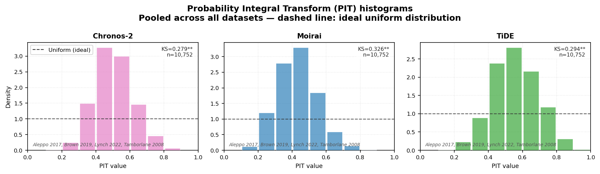

Use this for aggregate calibration shape checks (uniform vs U-shape/skew/hump patterns).

### `plot_pit_horizon_heatmap.py`

**Stored examples:**
- [pit_horizon_heatmap.png](/data/home/cjrisi/nocturnal-hypo-gly-prob-forecast/docs/assets/visualizations/examples/plot_pit_horizon_heatmap/pit_horizon_heatmap.png)
- [pit_mad_over_horizon.png](/data/home/cjrisi/nocturnal-hypo-gly-prob-forecast/docs/assets/visualizations/examples/plot_pit_horizon_heatmap/pit_mad_over_horizon.png)

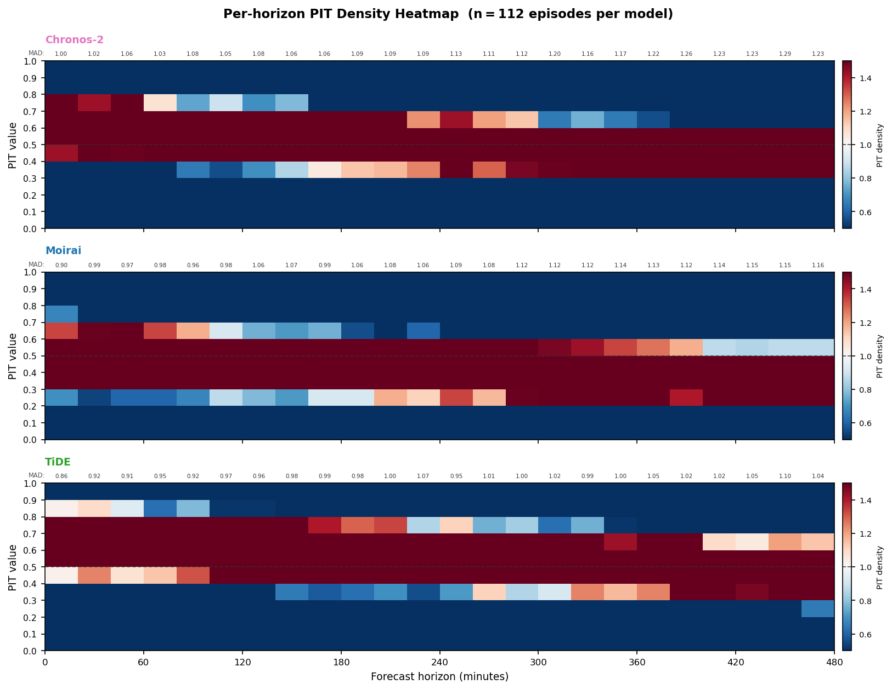

Use this to locate where in the horizon calibration fails. Look for strong color shifts toward later bins.

### `plot_probabilistic_forecast_grid.py`

**Stored example:** [plot_probabilistic_forecast_grid.png](/data/home/cjrisi/nocturnal-hypo-gly-prob-forecast/docs/assets/visualizations/examples/plot_probabilistic_forecast_grid.png)

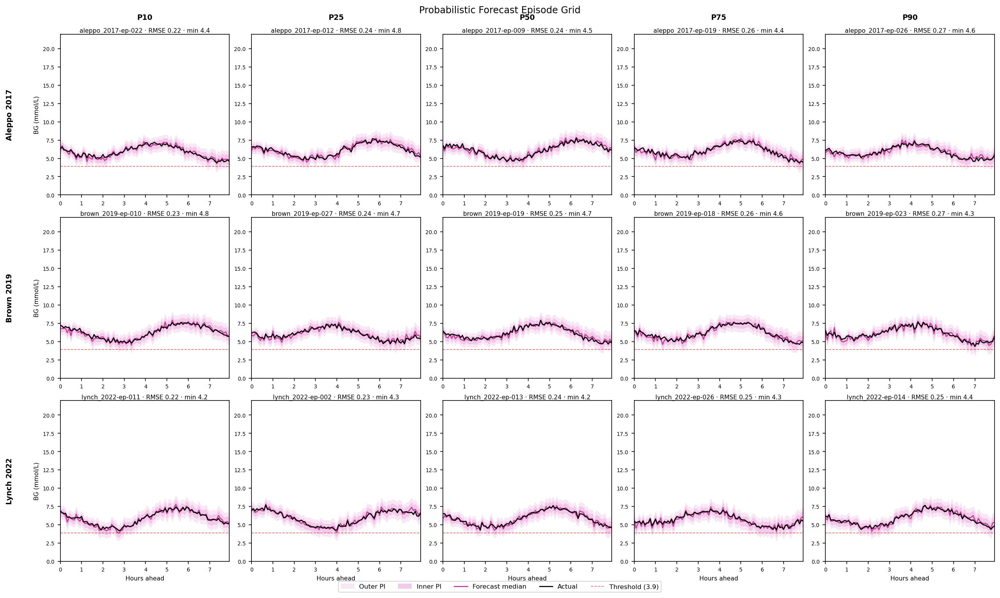

Use this for percentile-stratified episode behavior by dataset. Compare interval adequacy and median-shape degradation from easy to hard columns.

### `plot_reliability_diagrams.py`

**Stored examples:**
- [reliability_main_body.png](/data/home/cjrisi/nocturnal-hypo-gly-prob-forecast/docs/assets/visualizations/examples/plot_reliability_diagrams/reliability_main_body.png)
- [plot_reliability_diagrams/](/data/home/cjrisi/nocturnal-hypo-gly-prob-forecast/docs/assets/visualizations/examples/plot_reliability_diagrams)

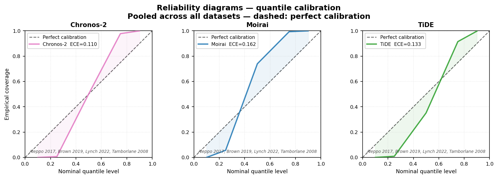

Use this to evaluate quantile calibration directly against the diagonal; larger ECE and off-diagonal curves indicate worse calibration.

### `plot_rmse_vs_horizon.py`

**Stored example:** [plot_rmse_vs_horizon.svg](/data/home/cjrisi/nocturnal-hypo-gly-prob-forecast/docs/assets/visualizations/examples/plot_rmse_vs_horizon.svg)

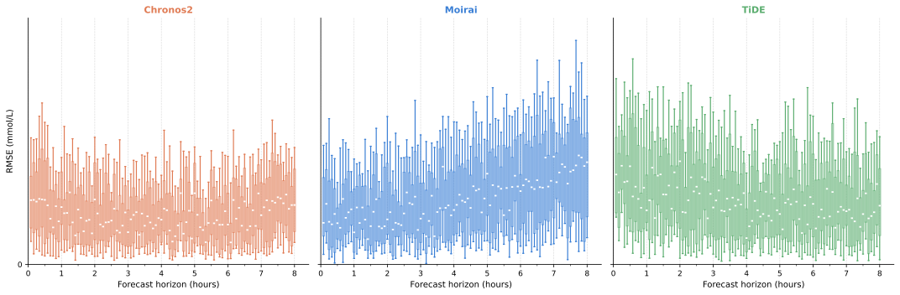

Use this for per-horizon error distribution, not just average error. Watch for widening boxes and high whiskers at long horizons.

### `plot_rmse_vs_horizon_grid.py`

**Stored example:** [plot_rmse_vs_horizon_grid.svg](/data/home/cjrisi/nocturnal-hypo-gly-prob-forecast/docs/assets/visualizations/examples/plot_rmse_vs_horizon_grid.svg)

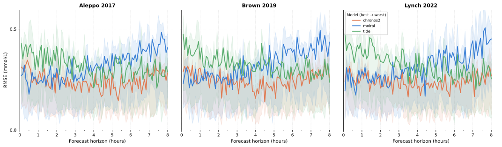

Use this to compare model rank trajectories across horizon and dataset. Focus on crossings and IQR inflation.

### `plot_step_sweep.py`

**Stored example:** [plot_step_sweep.png](/data/home/cjrisi/nocturnal-hypo-gly-prob-forecast/docs/assets/visualizations/examples/plot_step_sweep.png)

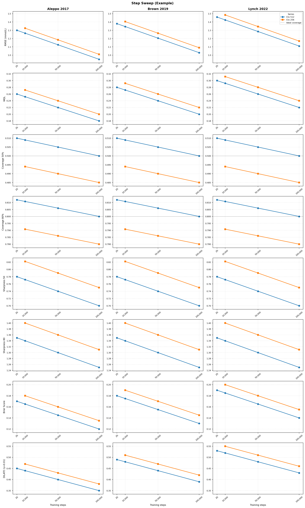

Use this for short/medium step sweep comparisons across generic series values. Look for early gains, calibration stability, and series consistency across datasets.
